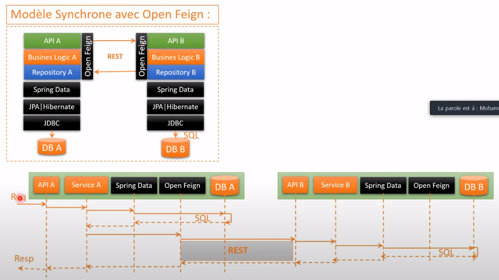
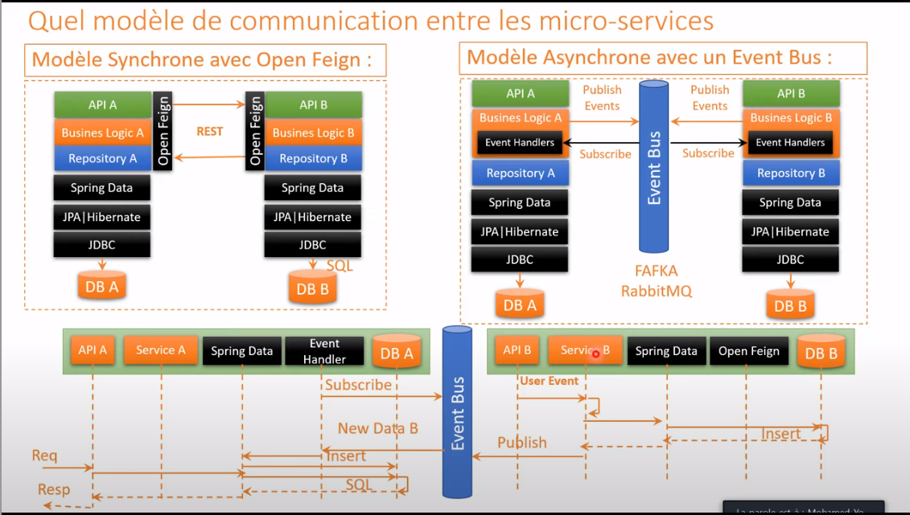
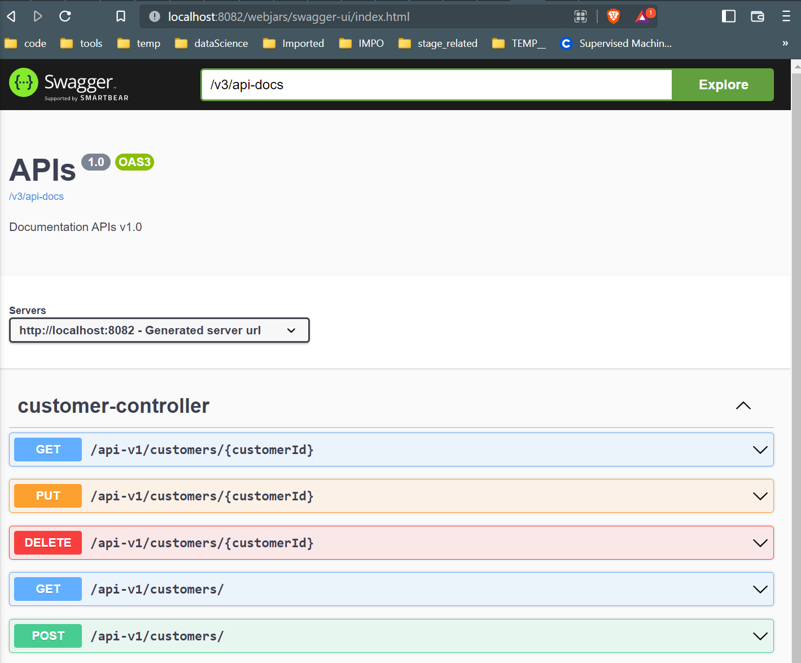
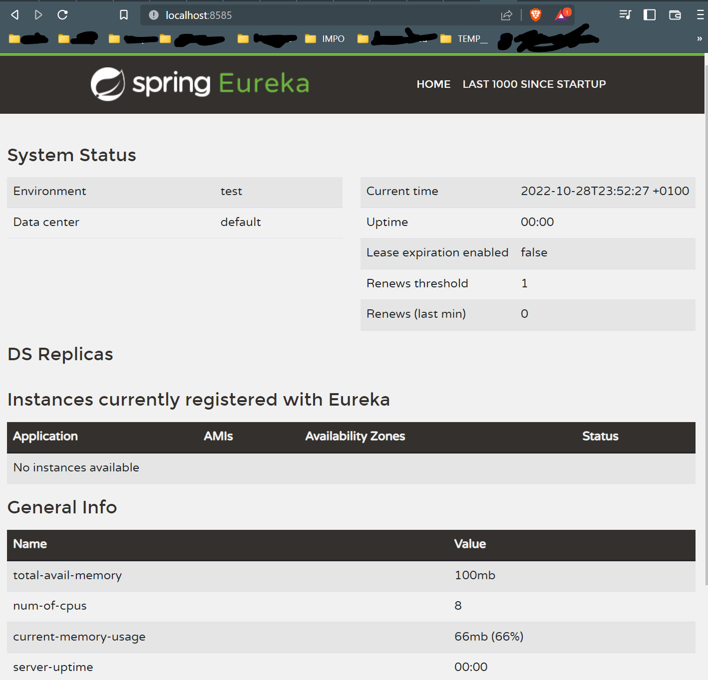
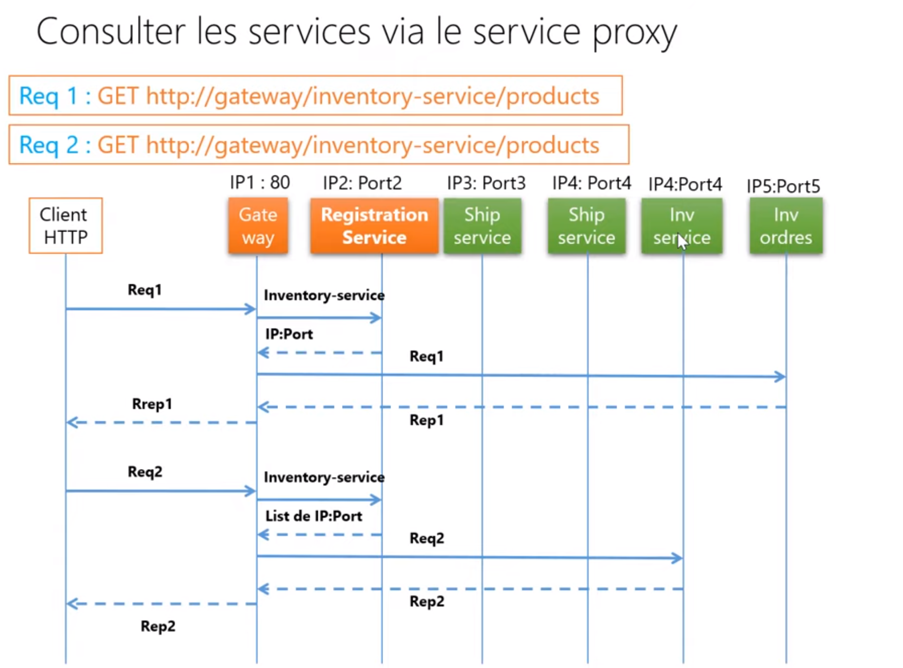
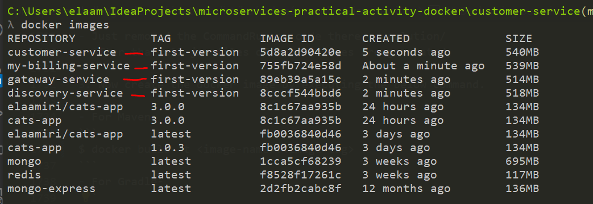

# Les bonnes pratiques et challenges des architectures distribuées basées sur les Micro-services 

**Remember**:

<fieldset>

**“IOC”, “DI” mais c’est quoi au juste?**

L’inversion de contrôle ou IOC pour inversion of control est un principe général de conception dont le but est de diminuer le couplage entre les composants logiciels.

L’injection de dépendances ou DI pour “dependency injection”, est-elle une méthode permettant d’appliquer le principe d’IOC. Le principe est tout simple, il consiste à passer (injecter) un composant logiciel (une classe par exemple) à un autre composant logiciel qui l’utilise, permettant ainsi d’éviter la dépendance d’un composant à un autre et ainsi améliorer la souplesse de l’application.

[<GO TO LINK>](https://www.codeheroes.fr/2017/10/10/node-js-linversion-de-controle-ioc-et-linjection-de-dependances-di/#:~:text=L'inversion%20de%20contr%C3%B4le%20ou,appliquer%20le%20principe%20d'IOC.)

</fieldset>


### Content 
1. [Basics](#architecture-micro-services-et-contraintes)
    1. [Architecture Monolotique et contraintes](#architecture-monolotique-et-contraintes)
    2. [Architecture Micro-services et contraintes](#architecture-micro-services-et-contraintes)
    3. [Gateway](#gateway)
    4. [Modèle de communication entre les microservices](#modèle-de-communication-entre-les-microservices)
    5. [Security challenge ](#security-challenge)
    6. [How to deal with my data ?](#how-to-deal-with-my-data)
    7. [How to deal with my data : CQRS & Event Sourcing](#how-to-deal-with-my-data--cqrs--event-sourcing)
2. [Demo](#demo)
    1. [Use case](#use-case)
    2. [Customer service](#customer-service)
        1. [Dependencies](#customer-service-dependencies)
        2. [Properties file](#customer-service-properties-file)
        3. [JPA Entity](#customer-service-entity)
        4. [JPA Repository](#customer-service-repository)
        5. [Service layer](#customer-service-service-layer)
        6. [DTOs](#customer-service-dtos)
        7. [Mapping](#customer-service-mapping)
        8. [Rest Controller](#customer-service-rest-controller)
        9. [Customer Service tests](#customer-service-tests)
        10. [Documenting our service with openAPI (Swagger)](#documenting-our-service-with-openapi-swagger)
    3. [Billing Service](#billing-service)
        1. [Billing Service Dependencies ](#billing-service-dependencies)
        2. [Billing Service Properties file](#billing-service-properties-file)
        3. [Billing Service Entity](#billing-service-entity)
        4. [Billing Service OpenFeign Client](#billing-service-openfeign-client)
        5. [Billing Service DTOs](#billing-service-dtos)
        6. [Billing Service Mapping](#billing-service-mapping)
        7. [Billing Service Service layer](#billing-service-service-layer)
        8. [Billing Service Rest Controller](#billing-service-rest-controller)
        9. [Billing Service documentation](#billing-service-documentation)
        10. [Billing Service tests](#billing-service-tests)
    4. [Discovery service ](#discovery-service)
    5. [Gateway service](#gateway-service)
    6. [Refactoring]
        1. [Handling Exceptions](#handling-exceptions)
3. [ Dockerizing our micro-services](#dockerizing-our-micro-services)
    1. [Dockerise Using Docker File and Docker compose](#dockerise-using-docker-file-and-docker-compose)
  


### Architecture Monolotique et contraintes:
- Basé sur plusieurs modèle qui ils sont intégrés dans la même application.
- Une seule base de données.
- Une seule technologie (Côut de formation).
- Processus Unique (Si une fonctionnalité arrête, l'application arrête completement).
- Difficiles à maintenir.
- Difficile à tester.
- Mise en production prend beaucoup de temps.
- Redéploiement à froid (obliger d'acrrêter l'app et la redéploier).
- Performances (Scalabilité).


### Architecture Micro-services et contraintes:
- Un ensembles des modèles séparés avec des bases de données séparées.
- Un ensembles des petites applications.
- Les application front-end ne doivent pas forcement savoir les microservices, ils ont besoin juste de connecter avec la `Gateway`.
- `Gateway` pour chaque requete reçus il va se charger d'acheminer la requete vers le bon Micro-service (Routage).
- Pour svoir dans quelle machine se trouve le Microservice, `Gateway` utilise `Discovery service`, pour un mappage dynamique surtout si on démarre plusieurs instance d'un microservice.
- `Discovery service` se chargé de publier ou d'enregistrer toutes les instance des Micro-services disponibles.
- Chaque microservice qu'il démarre va enregistrer son adresse IP, nom, et port dans le `discovery service`.
- Pour ne pas avoir des conflits de configuration, on utilise le `Config service` qui va se charger de cnetraliser la configuration globale en commun.
- Le microservice reçoit sa configuration à chaud c à d sans avoir besoin l'arrêter.


<fieldset>

`Microservice cherche sa configuration dans Config service` &rarr; `Microservice Démarre` &rarr; `Microservice Démarre` &rarr; `Microservice Démarre` &rarr; 
.... youtba3
<fieldset>


- `Event Bus`: pour une communication asynchronne entre les microservices.

**Avantages**

- **Performance (Scalabilité Horzontale)** : Si on a un problème de monté en charge il suffit démarrer d'autres instances du micro-service affecter, il va s'enregistrer dans le `discovery service` et il va etre disponible, la `Gateway` dans ce cas là va utiliser un système d'équilibrage de charge `load balancer` entre les instances.
- Processus séparés.
- Faciles à développer à tester et à maintenir.
- Mise en production rapide des micro-services.
- Redéploiement à chaud.
- Téchnologies déffirentes.
- Equipes indépendentes.
- Facile à appliquer l'agilité.
- Facile à mettre en oeuvre TDD (Test puis fonctionnalité).

### Gateway

|ZUUL|Spring Cloud Gateway|
|--|--|
|Modèle Multi thread avec des entrés sorties bloquantes|Modèle Single thread avec des entrés sorties non bloquantes|
|Thread pour chaque requête|Un thread pour toutes les requetes (Event loop)|
|Thread peut etre mobiliser pour une longue durée |Asychronisation, buffering pour servir plusieurs reqêtes|
|N'est pas scalable virticalement |Scalable virticalement|
|Limité par le nombre maximal des threads  |limité par les ressources uniquement|

### Modèle de communication entre les microservices

|Modèle synchrone|Modèle asynchrone|
|--|--|
|REST avec `Open Feign`|Par des `Event Bus`/ `Broker` avec `Kafka, RabbitMQ`|
|Utiliser l'API du service pour envoyer des requêtes HTTP |Les service fait un subscribe dans event bus et attends pour les informations arrivées|
| | |


### Security challenge 

|Modèle d'authentification `Statful`|Modèle d'authentification `Statless`|
|--|--|
|Les informations de la session s'enregistrent dans le côté serveur, le client reçoit un Session ID unique à conserver dans les Cookies pour l'envoyer avec les prochaines requêtes|Les données de la session sont enregistrées dans un `jeton`/ `token` d'authentification délivré au client |
|Utilisé dans la majorité des cas dans les applications monolitiques||
|-|Ex. JWT..|
|-|Plus adapté au Micro-services car on a pas de session partagé entre les services|


**Quelques outils à savoir en ralation avec sécurité**:
- Spring Security
- OAuth2
- JWT
- OpenID Connect
- **Keycloak** : [https://www.keycloak.org/] => Outils prêt
- Spring cloud OAuth


### How to deal with my data ?

- Garder l'architecture Microservices mais avec une seule base de données ??
- L'ideal c'est d'utiliser une DB pour chaque Micro-service, pour garder la performance et la scalabilité.
- Plus Ideal : Utiliser les deux au même temps avec un `Event Bus`: c'est d'avoir des microservices avec leurs bases de données + un qui a une bas de données globale, dans laquel il stock tous les données, Ce microservice attend les evenements du Broker (Event Bus) et mis à jour la base globale.


- On peut fair la même chose si par exemple on a besoin à une base de données pour un moteur de recherche (Elasticsearch), il suffit de créer un autre service handler.


#### How to deal with my data : CQRS & Event Sourcing

- **CQRS**: Command Query Responsability Segregation
- A pattern that separates read and update operations for a data store. Implementing CQRS in your application can maximize its performance, scalability, and security.
- Séparer le bus de lecture du bus d'écriture.
- Le bus de `Command` permet de modifier les données
- Le bus de `Query` permet de la lecture des données.
- **Event Sourcing**: An patern qui consist à ne pas enregister le dernier état de l'application dans la base de donnée mais, d'enregister tous les élements (evenements) de l'application, et qui permet de retrouver l'état de notre app (Je veux l'état de ma base de données d'un mois avant...).
- Outils : `Spring cloud`, `AXION Framework`.
- 

----------------------------------

## Demo

### Use case :
- Respecter tous les bonnes pratiques:


<pre>
Travail à faire :
 Suivre les vidéos Bonnes pratiques de Architectures micro-services :
 1. Vidéo 1 : Concepts de bases
 2.  Vidéo 2 à 5 : Mise en oeuvre d'une application distribuée basée sur deux micro-services en utilisant les bonnes pratiques  :
  - Couches DA0, Service, Web, DTO
  - Utilisation de MapStruct pour le mapping entre les objet Entities et DTO
  - Génération des API-DOCS en utilisant SWAGGER3 (Open API)
  - Communication entre micro-services en utilisant OpenFeign
  - Spring Cloud Gateway
  - Eureka Discovery Service
Travail à rendre Dimanche 31 Octobre
  - etc...
</pre>

### Customer Service

<pre>
DTO: Data transfer object => Objects adapted to the UI layer, it is just a fransfer of the data.
</pre>

#### Customer Service Dependencies 

in `build.gradle`  file (or `pom.xml`) if we use maven we add dependencies.

```groovy
dependencies {
	implementation 'org.springframework.boot:spring-boot-starter-data-jpa'
	implementation 'org.springframework.boot:spring-boot-starter-validation'
	implementation 'org.springframework.boot:spring-boot-starter-webflux'
	implementation 'org.springframework.cloud:spring-cloud-starter-gateway'
	implementation 'org.springframework.cloud:spring-cloud-starter-netflix-eureka-client'
	compileOnly 'org.projectlombok:lombok'
	runtimeOnly 'com.h2database:h2'
	annotationProcessor 'org.projectlombok:lombok'
	testImplementation 'org.springframework.boot:spring-boot-starter-test'
	testImplementation 'io.projectreactor:reactor-test'
	implementation 'org.mapstruct:mapstruct:1.5.3.Final'
	annotationProcessor 'org.mapstruct:mapstruct-processor:1.5.3.Final'
	// https://mvnrepository.com/artifact/org.springdoc/springdoc-openapi-ui
	implementation 'org.springdoc:springdoc-openapi-ui:1.6.12'
}

```

If you are a Maven user, add the following dependencies to your pom.xml file:

```xml
<dependencies>
    <!-- ... -->
    <dependency>
        <groupId>org.mapstruct</groupId>
        <artifactId>mapstruct</artifactId>
        <version>1.4.2.Final</version>
    </dependency>   
</dependencies>

<!-- ... -->
<build>
    <plugins>
        <!-- ... -->
        <plugin>
            <groupId>org.apache.maven.plugins</groupId>
            <artifactId>maven-compiler-plugin</artifactId>
            <version>3.8.1</version>
            <configuration>
                <source>17</source> <!-- depending on your project. In this example, Java 11 is used -->
                <target>17</target> <!-- depending on your project. In this example, Java 11 is used -->
                <annotationProcessorPaths>
                    <!-- Here we can add the path for lombok -->
                    <path>
                        <groupId>org.projectlombok</groupId> 
                        <artifactId>lombok</artifactId>
                        <version>1.18.16</version>
                    </path>
                    <path>
                        <groupId>org.mapstruct</groupId> 
                        <artifactId>mapstruct-processor</artifactId>
                        <version>1.4.2.Final</version>
                    </path>
                </annotationProcessorPaths>
            </configuration>
        </plugin>
    </plugins>
</build>
```
from: https://maven.apache.org/plugins/maven-compiler-plugin/compile-mojo.html 
<pre>
Classpath elements to supply as annotation processor path. If specified, the compiler will detect annotation processors only in those classpath elements. If omitted, the default classpath is used to detect annotation processors. The detection itself depends on the configuration of annotationProcessors.

Each classpath element is specified using their Maven coordinates (groupId, artifactId, version, classifier, type). Transitive dependencies are added automatically. Example:
</pre>

```xml
<configuration>
  <annotationProcessorPaths>
    <path>
      <groupId>org.sample</groupId>
      <artifactId>sample-annotation-processor</artifactId>
      <version>1.2.3</version>
    </path>
    <!-- ... more ... -->
  </annotationProcessorPaths>
</configuration>
```


#### Customer Service Properties file

```properties
server.port=8082
spring.application.name=CUSTOMER-SERVER
spring.h2.console.enabled=false
spring.cloud.discovery.enabled=false # prevent server to be registred to discovery service
spring.datasource.url=jdbc:h2:mem:customer-db
```

#### Customer Service Entity

```java

@Data
@Entity
@NoArgsConstructor @Builder
@AllArgsConstructor
public class Customer {
    @Id
    private String id;
    @NotBlank
    private String name;
    @Email
    private String email;
}
```

#### Customer Service Repository

```java
@Repository
public interface CustomerRepository extends JpaRepository<Customer, String> {
}

```

#### Customer Service Service layer

```java
@Service
@Transactional
public interface CustomerService {

    CustomerResponseDTO saveCustomer(CustomerRequestDTO customerRequestDTO);

    CustomerResponseDTO getCustomer(String id);

    CustomerResponseDTO updateCustomer(String id, CustomerRequestDTO customerRequestDTO);

    boolean deleteCustomer(String id);

    List<CustomerResponseDTO> getAllCustomers(int page, int size);
}

```
Implementation

```java

@Service
@Transactional
@AllArgsConstructor
public class CustomerServiceImpl implements CustomerService {

    private CustomerRepository customerRepository;
    private CustomerMapper customerMapper;

    @Override
    public CustomerResponseDTO saveCustomer(CustomerRequestDTO customerRequestDTO){
        Customer customer = customerMapper.toCustomer(customerRequestDTO);
        customer.setId(UUID.randomUUID().toString());
        Customer savedCustomer = customerRepository.save(customer);
        return customerMapper.toCustomerResponse(savedCustomer);
    }

    @Override
    public CustomerResponseDTO getCustomer(String id){
        Customer customer = customerRepository
                .findById(id)
                .orElseThrow( () -> {
                    return  new  RuntimeException(String.format("Customer with ID: %s Not found !", id));
                });
        return customerMapper.toCustomerResponse(customer);
    }

    @Override
    public CustomerResponseDTO updateCustomer(String id, CustomerRequestDTO customerRequestDTO){
        Customer customer = customerRepository
                .findById(id)
                .orElseThrow( () -> {
                    return  new  RuntimeException(String.format("Customer with ID: %s Not found !", id));
                });

        Customer customerMap = customerMapper.toCustomer(customerRequestDTO);
        customerMap.setId(id);
        Customer savedCustomer = customerRepository.save(customerMap);
        return customerMapper.toCustomerResponse(savedCustomer);
    }

    @Override
    public boolean deleteCustomer(String id){
        customerRepository.deleteById(id);
        return true;
    }

    @Override
    public List<CustomerResponseDTO> getAllCustomers(int page, int size){
        Page<Customer> customerPage = customerRepository.findAll(PageRequest.of(page, size));
        List<CustomerResponseDTO> customerResponseDTOList =
                customerPage.getContent().stream().map(customer -> customerMapper.toCustomerResponse(customer)).collect(Collectors.toList());
        return customerResponseDTOList;
    }

}
```

#### Customer Service DTOs

```java

@Data
@AllArgsConstructor
@NoArgsConstructor
@Builder

public class CustomerRequestDTO {
    private String id;
    private String name;
    private String email;
}

```

```java

@Data @AllArgsConstructor @NoArgsConstructor @Builder
public class CustomerResponseDTO {
    private String id;
    private String name;
    private String email;
}

```

#### Customer Service Mapping

Documentation: https://mapstruct.org/documentation/stable/reference/html/ 
Get Statted with mapstruct : https://mapstruct.org/ 

`CustomerMapper` interface in the mappers package
```java

@Mapper(componentModel = "spring")
public interface CustomerMapper {
    CustomerResponseDTO toCustomerResponse(Customer customer);
    Customer toCustomer(CustomerRequestDTO customerRequestDTO);
}

```

#### Customer Service Rest Controller

```java

@RestController
@RequestMapping(path = "/api-v1/customer-service")
@AllArgsConstructor
public class CustomerController {
    private CustomerService customerService;

    @GetMapping("/")
    public List<CustomerResponseDTO> getCustomerList(@RequestParam(name = "page", defaultValue = "0") int page,
                                                     @RequestParam(name = "size", defaultValue = "10") int size ){

        return customerService.getAllCustomers(page, size);
    }

    @GetMapping ("/{customerId}")
    public CustomerResponseDTO getCustomer(@PathVariable(name = "customerId") String id){
        return customerService.getCustomer(id);
    }

    @PostMapping("/")
    public CustomerResponseDTO insertCustomer(@RequestBody CustomerRequestDTO customerRequestDTO){
        return customerService.saveCustomer(customerRequestDTO);
    }

    @PutMapping("/{customerId}")
    public CustomerResponseDTO updateCustomer(@PathVariable(name = "customerId") String id,
                                              @RequestBody CustomerRequestDTO customerRequestDTO){
        return customerService.updateCustomer(id, customerRequestDTO);
    }

    @DeleteMapping("/{customerId}")
    public boolean updateCustomer(@PathVariable(name = "customerId") String id){
        return customerService.deleteCustomer(id);
    }

}

```

#### Customer Service tests

Adding 2 Customers at the begining 

```java
@Bean
	CommandLineRunner start(CustomerRepository customerRepository){
		return args -> {
			// Create just 2 customers

			List.of("Ahmed", "Essadeq").forEach( c ->{
				Customer customer = new Customer(null, c, String.format("%s_email@gmail.com", c));
				customerRepository.save(customer);
			});
		};
	}
```

H2-console consulting:

**Problem**:
- Do not have access to `http://localhost:8082/h2-console`

<pre>
Whitelabel Error Page
This application has no configured error view, so you are seeing this as a fallback.

Wed Oct 26 15:39:39 WEST 2022
[bb486a63-3] There was an unexpected error (type=Not Found, status=404).
org.springframework.web.server.ResponseStatusException: 404 NOT_FOUND
	at org.springframework.web.reactive.resource.ResourceWebHandler.lambda$handle$1(ResourceWebHandler.java:408)
	Suppressed: The stacktrace has been enhanced by Reactor, refer to additional information below: 
Error has been observed at the following site(s):
	*__checkpoint ⇢ org.springframework.cloud.gateway.filter.WeightCalculatorWebFilter [DefaultWebFilterChain]
	*__checkpoint ⇢ HTTP GET "/h2-console" [ExceptionHandlingWebHandler]
Original Stack Trace: ...
</pre>

- Tried to install `devtools`, but did not resolve the problem.
- `spring.h2.console.enabled=true` did not resolve the problem.

But the application works fine:

Visiting `http://localhost:8082/api-v1/customers/`

```json
[{"id":"96fe8548-ceda-420c-8a50-b4d4ab3b75c1","name":"Ahmed","email":"Ahmed_email@gmail.com"},{"id":"d62da59d-6483-4535-948b-63fd2751e81d","name":"Essadeq","email":"Essadeq_email@gmail.com"}]
```
Visiting : `http://localhost:8082/api-v1/customers/96fe8548-ceda-420c-8a50-b4d4ab3b75c1`

```json
{"id":"96fe8548-ceda-420c-8a50-b4d4ab3b75c1","name":"Ahmed","email":"Ahmed_email@gmail.com"}
```

Tested with `restClient` VScode extension :
Usage : https://marketplace.visualstudio.com/items?itemName=MadsKristensen.RestClient
Usage 2: https://medium.com/refinitiv-developer-community/how-to-test-rest-api-with-visual-studio-code-rest-client-extensions-9f2e061d0299

File:  [FILE_LINK](./restClient.http)

```http
@hostname = localhost
@port = 8082
@contentType = application/json
@baseUrl = http://{{hostname}}:{{port}}/api-v1/customers/
POST {{baseUrl}} HTTP/1.1
Content-Type: {{contentType}}

{
    "name":"Laila",
    "email":"laila@gmail.com"
}

# edit
PUT {{baseUrl}}e07ba26b-6620-4733-a9d0-47cc9b2c2f59 HTTP/1.1
Content-Type: {{contentType}}
{
    "id" : null,
    "name":"Laila_edited",
    "email":"laila@gmail.com"
}

# list all 

GET {{baseUrl}} HTTP/1.1

```

Tested also with Postman ==> everything works fine [ :smile: DONE]

#### Documenting our service with openAPI (Swagger)

Adding the dependency 
```groovy
// https://mvnrepository.com/artifact/org.springdoc/springdoc-openapi-ui
implementation 'org.springdoc:springdoc-openapi-ui:1.6.12'

```

Visiting : `http://localhost:8082/v3/api-docs` we will have our API documentation, which can be used with any testion tool (Postman ...).

INFO: https://www.baeldung.com/spring-rest-openapi-documentation 

To use a custom path, we can indicate in the application.properties file:

```properties
springdoc.api-docs.path=/api-docs
```
Now we'll be able to access the docs at:

`http://localhost:8080/api-docs/`

The OpenAPI definitions are in JSON format by default. For yaml format, we can obtain the definitions at:

`http://localhost:8080/api-docs.yaml`

Besides generating the OpenAPI 3 specification itself, we can integrate springdoc-openapi with Swagger UI so that we can interact with our API specification and exercise the endpoints.

The springdoc-openapi dependency already includes Swagger UI, so we're all set here.

We can simply access the API documentation at:

`http://localhost:8080/swagger-ui.html`

- `OpenAPI` is the equivalent of `WSDL` for `SOAP` based  services
- What's that ?

<pre>
REST versus SOAP. It’s been an issue for a while now. And really, they’re just two answers to the 
same question: how to access web services.

But deciding one over the other can be surprisingly difficult.

SOAP (Simple Object Access Protocol) is a standards-based web services access protocol that has 
been around for a long time. Originally developed by Microsoft, SOAP isn’t as simple as the 
acronym would suggest.

REST (Representational State Transfer) is another standard, made in response to SOAP’s 
shortcomings. It seeks to fix the problems with SOAP and provide a simpler method of accessing web 
services. 

What about GraphQL?
Of course, GraphQL has recently made a huge splash, which we’ve spoken of at length in other 
articles. But it’s still not as standardized as REST and SOAP, so in this article we’re just going 
to focus on those two.
</pre>

**Problems**
404 Error on `http://localhost:8082/h2-console` and `http://localhost:8082/v3/api-docs`

<pre>
Whitelabel Error Page
This application has no configured error view, so you are seeing this as a fallback.

Wed Oct 26 17:03:21 WEST 2022
[75afbc90-6] There was an unexpected error (type=Not Found, status=404).
</pre>

Raison:  

<pre>
As per your logs, I found that, you are using an embedded server, other than tomcat, i.e, spring-boot-starter-reactor-netty that comes along with spring webflux dependency.

H2ConsoleAutoConfiguration will not be executed for spring webflux & netty(reactor based), as H2 console will only be available to servlet based applications. So, you have to configure H2 server manually in this spring boot application, with spring webflux & netty.
</pre> 

Suggested solutions:  
https://stackoverflow.com/questions/63646864/spring-boot-h2-console-returns-404

https://stackoverflow.com/questions/52949088/h2-db-not-accessible-at-localhost8080-h2-console-when-using-webflux

**Solution for** : `http://localhost:8082/v3/api-docs`

- Adding the dependency to `duild.gradle` :

```groovy
// https://mvnrepository.com/artifact/org.springdoc/springdoc-openapi-webflux-ui
implementation 'org.springdoc:springdoc-openapi-webflux-ui:1.6.12'
```
Instead of 

```groovy
// https://mvnrepository.com/artifact/org.springdoc/springdoc-openapi-ui
implementation 'org.springdoc:springdoc-openapi-ui:1.6.12'
```

- Adding the config in the `Application`

```java

@SpringBootApplication
@OpenAPIDefinition(info = @Info(title = "APIs", version = "1.0", description = "Documentation APIs v1.0"))
public class CustomerServiceApplication {

	public static void main(String[] args) {
		SpringApplication.run(CustomerServiceApplication.class, args);
	}

	@Bean
	CommandLineRunner start(CustomerRepository customerRepository){
		return args -> {
			// Create just 2 customers

			List.of("Ahmed", "Essadeq").forEach( c ->{
				Customer customer = new Customer(UUID.randomUUID().toString(), c, String.format("%s_email@gmail.com", c));
				customerRepository.save(customer);
			});
		};
	}
}

```

// here is the description of our API

<details>

```json
{
   "openapi":"3.0.1",
   "info":{
      "title":"APIs",
      "description":"Documentation APIs v1.0",
      "version":"1.0"
   },
   "servers":[
      {
         "url":"http://localhost:8082",
         "description":"Generated server url"
      }
   ],
   "paths":{
      "/api-v1/customers/{customerId}":{
         "get":{
            "tags":[
               "customer-controller"
            ],
            "operationId":"getCustomer",
            "parameters":[
               {
                  "name":"customerId",
                  "in":"path",
                  "required":true,
                  "schema":{
                     "type":"string"
                  }
               }
            ],
            "responses":{
               "200":{
                  "description":"OK",
                  "content":{
                     "*/*":{
                        "schema":{
                           "$ref":"#/components/schemas/CustomerResponseDTO"
                        }
                     }
                  }
               }
            }
         },
         "put":{
            "tags":[
               "customer-controller"
            ],
            "operationId":"updateCustomer",
            "parameters":[
               {
                  "name":"customerId",
                  "in":"path",
                  "required":true,
                  "schema":{
                     "type":"string"
                  }
               }
            ],
            "requestBody":{
               "content":{
                  "application/json":{
                     "schema":{
                        "$ref":"#/components/schemas/CustomerRequestDTO"
                     }
                  }
               },
               "required":true
            },
            "responses":{
               "200":{
                  "description":"OK",
                  "content":{
                     "*/*":{
                        "schema":{
                           "$ref":"#/components/schemas/CustomerResponseDTO"
                        }
                     }
                  }
               }
            }
         },
         "delete":{
            "tags":[
               "customer-controller"
            ],
            "operationId":"updateCustomer_1",
            "parameters":[
               {
                  "name":"customerId",
                  "in":"path",
                  "required":true,
                  "schema":{
                     "type":"string"
                  }
               }
            ],
            "responses":{
               "200":{
                  "description":"OK",
                  "content":{
                     "*/*":{
                        "schema":{
                           "type":"boolean"
                        }
                     }
                  }
               }
            }
         }
      },
      "/api-v1/customers/":{
         "get":{
            "tags":[
               "customer-controller"
            ],
            "operationId":"getCustomerList",
            "parameters":[
               {
                  "name":"page",
                  "in":"query",
                  "required":false,
                  "schema":{
                     "type":"integer",
                     "format":"int32",
                     "default":0
                  }
               },
               {
                  "name":"size",
                  "in":"query",
                  "required":false,
                  "schema":{
                     "type":"integer",
                     "format":"int32",
                     "default":10
                  }
               }
            ],
            "responses":{
               "200":{
                  "description":"OK",
                  "content":{
                     "*/*":{
                        "schema":{
                           "type":"array",
                           "items":{
                              "$ref":"#/components/schemas/CustomerResponseDTO"
                           }
                        }
                     }
                  }
               }
            }
         },
         "post":{
            "tags":[
               "customer-controller"
            ],
            "operationId":"insertCustomer",
            "requestBody":{
               "content":{
                  "application/json":{
                     "schema":{
                        "$ref":"#/components/schemas/CustomerRequestDTO"
                     }
                  }
               },
               "required":true
            },
            "responses":{
               "200":{
                  "description":"OK",
                  "content":{
                     "*/*":{
                        "schema":{
                           "$ref":"#/components/schemas/CustomerResponseDTO"
                        }
                     }
                  }
               }
            }
         }
      }
   },
   "components":{
      "schemas":{
         "CustomerRequestDTO":{
            "type":"object",
            "properties":{
               "id":{
                  "type":"string"
               },
               "name":{
                  "type":"string"
               },
               "email":{
                  "type":"string"
               }
            }
         },
         "CustomerResponseDTO":{
            "type":"object",
            "properties":{
               "id":{
                  "type":"string"
               },
               "name":{
                  "type":"string"
               },
               "email":{
                  "type":"string"
               }
            }
         }
      }
   }
}
```
</details>

Visiting : `http://localhost:8082/webjars/swagger-ui/index.html`




:warning:

**By careful**

```diff
- By mistake, I was adding the gateway dependency to my app, so the dependency manager keeped 
- install Spring webflux for me instead of Spring Web.
```

--------------------

### Billing Service


#### Billing Service Dependencies 


Here is  the dependencies and the configuration 

[Show all code]

<details>

```xml
<?xml version="1.0" encoding="UTF-8"?>
<project xmlns="http://maven.apache.org/POM/4.0.0" xmlns:xsi="http://www.w3.org/2001/XMLSchema-instance"
         xsi:schemaLocation="http://maven.apache.org/POM/4.0.0 https://maven.apache.org/xsd/maven-4.0.0.xsd">
    <modelVersion>4.0.0</modelVersion>
    <parent>
        <groupId>org.springframework.boot</groupId>
        <artifactId>spring-boot-starter-parent</artifactId>
        <version>2.7.5</version>
        <relativePath/> <!-- lookup parent from repository -->
    </parent>
    <groupId>me.elaamiri</groupId>
    <artifactId>my-billing-service</artifactId>
    <version>0.0.1-SNAPSHOT</version>
    <name>my-billing-service</name>
    <description>my-billing-service</description>
    <properties>
        <java.version>17</java.version>
        <spring-cloud.version>2021.0.4</spring-cloud.version>
        <org.mapstruct.version>1.5.3.Final</org.mapstruct.version>
    </properties>
    <dependencies>
        <dependency>
            <groupId>org.springframework.boot</groupId>
            <artifactId>spring-boot-starter-data-jpa</artifactId>
        </dependency>
        <dependency>
            <groupId>org.springframework.boot</groupId>
            <artifactId>spring-boot-starter-validation</artifactId>
        </dependency>
        <dependency>
            <groupId>org.springframework.boot</groupId>
            <artifactId>spring-boot-starter-web</artifactId>
        </dependency>
        <dependency>
            <groupId>org.springframework.cloud</groupId>
            <artifactId>spring-cloud-starter-netflix-eureka-client</artifactId>
        </dependency>

        <dependency>
            <groupId>com.h2database</groupId>
            <artifactId>h2</artifactId>
            <scope>runtime</scope>
        </dependency>
        <dependency>
            <groupId>org.projectlombok</groupId>
            <artifactId>lombok</artifactId>
            <optional>true</optional>
        </dependency>
        <dependency>
            <groupId>org.springframework.boot</groupId>
            <artifactId>spring-boot-starter-test</artifactId>
            <scope>test</scope>
        </dependency>

        <dependency>
            <groupId>org.mapstruct</groupId>
            <artifactId>mapstruct</artifactId>
            <version>${org.mapstruct.version}</version>
        </dependency>
        <!-- https://mvnrepository.com/artifact/org.springdoc/springdoc-openapi-ui -->
        <dependency>
            <groupId>org.springdoc</groupId>
            <artifactId>springdoc-openapi-ui</artifactId>
            <version>1.6.12</version>
        </dependency>
    </dependencies>
    <dependencyManagement>
        <dependencies>
            <dependency>
                <groupId>org.springframework.cloud</groupId>
                <artifactId>spring-cloud-dependencies</artifactId>
                <version>${spring-cloud.version}</version>
                <type>pom</type>
                <scope>import</scope>
            </dependency>


        </dependencies>
    </dependencyManagement>

    <build>
        <plugins>
            <plugin>
                <groupId>org.springframework.boot</groupId>
                <artifactId>spring-boot-maven-plugin</artifactId>
                <configuration>
                    <excludes>
                        <exclude>
                            <groupId>org.projectlombok</groupId>
                            <artifactId>lombok</artifactId>
                        </exclude>
                    </excludes>
                </configuration>
            </plugin>

            <plugin>
                <groupId>org.apache.maven.plugins</groupId>
                <artifactId>maven-compiler-plugin</artifactId>
                <version>3.8.1</version>
                <configuration>
                    <source>${java.version}</source> <!-- depending on your project -->
                    <target>${java.version}</target> <!-- depending on your project -->
                    <annotationProcessorPaths>
                        <path>
                            <groupId>org.projectlombok</groupId>
                            <artifactId>lombok</artifactId>
                            <version>1.18.16</version>
                        </path>
                        <path>
                            <groupId>org.mapstruct</groupId>
                            <artifactId>mapstruct-processor</artifactId>
                            <version>${org.mapstruct.version}</version>
                        </path>
                        <!-- other annotation processors -->
                    </annotationProcessorPaths>
                </configuration>
            </plugin>
        </plugins>
    </build>

</project>

```
</details>

#### Billing Service Properties file

```properties
server.port=8083
spring.application.name=BILLING-SERVER
spring.h2.console.enabled=true
spring.cloud.discovery.enabled=false
spring.datasource.url=jdbc:h2:mem:billing-db
```

#### Billing Service Entity

Here is our Invoice entity 

```java

// facture
@Data @NoArgsConstructor @AllArgsConstructor @Builder
@Entity
public class Invoice {
    @Id
    private String id;
    @Temporal(TemporalType.DATE)
    private Date date;
    private BigDecimal amount;
    @NotBlank
    private String customerID;
    @Transient // Not to be persistent
    private Customer customer;
}
```
And the helperModel `Customer`

```java

@Data
public class Customer {
    private String id;
    private String name;
    private String email;
}

```

#### Billing Service Repository

```java

@Repository
public interface InvoiceRepository extends JpaRepository<Invoice, String> {
    Page<Invoice> findByCustomerID(String customerId, Pageable pageable);
}


```
#### Billing Service OpenFeign Client

Adding the dependency:

```xml
<!-- https://mvnrepository.com/artifact/org.springframework.cloud/spring-cloud-starter-openfeign -->
<dependency>
    <groupId>org.springframework.cloud</groupId>
    <artifactId>spring-cloud-starter-openfeign</artifactId>
    <version>3.1.4</version>
</dependency>

```

Adding a rest client to our service in the `openFeign` package:

```java

@FeignClient(name = "CUSTOMER-SERVICE")
// declare a rest client connected to CUSTOMER-SERVICE
public interface CustomerServiceRestClient {
    @GetMapping(path = "/api-v1/customers/{id}")
    Customer getCustomerById(@PathVariable String id);
    @GetMapping(path = "/api-v1/customers/")
    List<Customer> getCustomers();
}

```
- Now our service will have the possibility to access the data of customer service via this interface functions.

- This interface gives us the ability to manage the Customer-service data just like we do with JpaRepository, but via Rest (representational state transfer ) protocol.

- So **OpenFeign** gives us that possibility in a easy way 

Here when we call for example the function `getCustomerById()`, OpenFeign will just send an HTTP request to the `CUSTOMER-SERVICE` service (can retrieve it by the Discovery), and call the request on the path `/api-v1/customers/{id}`, that will return the serialized Customer to it, then it will return it a function returned Customer object....

To be able to use OpenFeign in our App we should enable it on the `Application` Main class.
Just by adding `@EnableFeignClients` at the top of  the Class

```java

@EnableFeignClients
@SpringBootApplication
public class MyBillingServiceApplication {

    public static void main(String[] args) {
        SpringApplication.run(MyBillingServiceApplication.class, args);
    }

}

```


#### Billing Service DTOs

```java
@Data
public class InvoiceRequestDTO {
    //private String id; // generated automatically , no need
    // private Date date; // generated automatically , no need
    private BigDecimal amount;
    private String customerId;

}

```

```java

@Data
public class InvoiceResponseDTO {
    private String id;
    private Date date;
    private BigDecimal amount;
    private String customerId;
    private Customer customer;
}

```

#### Billing Service Mapping

Using mapstruct:

```java

@Mapper(componentModel = "spring")
public interface InvoiceMapper {
    InvoiceResponseDTO toInvoiceResponse(Invoice invoice);
    Invoice toInvoice(InvoiceRequestDTO invoiceRequestDTO);
}

```

#### Billing Service Service layer

The Service 

```java

public interface InvoiceService {

    // list all
    List<InvoiceResponseDTO> getInvoicesList(int page, int size);
    // get one
    InvoiceResponseDTO getInvoiceById(String id);
    // insert
    InvoiceResponseDTO saveInvoice(InvoiceRequestDTO invoiceRequestDTO);
    // update
    InvoiceResponseDTO updateInvoice(String id, InvoiceRequestDTO invoiceRequestDTO);
    // delete
    boolean deleteInvoice(String id);
    // get customer's invoices
    List<InvoiceResponseDTO> getInvoicesListByCustomer(String customerId, int page, int size);

}

```
The Implementation 

[Show code details]

<details>

```java

@AllArgsConstructor
@Service
@Transactional
public class InvoiceServiceImp implements InvoiceService{

    private InvoiceRepository invoiceRepository;
    private InvoiceMapper invoiceMapper;

    private CustomerServiceRestClient customerServiceRestClient;

    @Override
    public List<InvoiceResponseDTO> getInvoicesList(int page, int size) {
        List<Invoice> invoiceList = invoiceRepository.findAll(PageRequest.of(page, size)).getContent();
        List<InvoiceResponseDTO> invoiceResponseDTOList = invoiceList.stream().map(
                invoice -> {
                    Customer customer = customerServiceRestClient.getCustomerById(invoice.getCustomerID());
                    if (customer == null) throw new RuntimeException(String.format("Can Not Find Customer with ID: %s", invoice.getCustomerID()));
                    invoice.setCustomer(customer);
                    return invoiceMapper.toInvoiceResponse(invoice);
                }
        ).collect(Collectors.toList());
        return invoiceResponseDTOList;
    }

    @Override
    public InvoiceResponseDTO getInvoiceById(String id) {
        Invoice invoice = invoiceRepository.findById(id).orElseThrow(() -> new RuntimeException(String.format("Invoice with ID: %s Not Found !", id)));
        Customer customer = customerServiceRestClient.getCustomerById(invoice.getCustomerID());
        if (customer == null) throw new RuntimeException(String.format("Can Not Find Customer with ID: %s", invoice.getCustomerID()));
        invoice.setCustomer(customer);
        return invoiceMapper.toInvoiceResponse(invoice);
    }

    @Override
    public InvoiceResponseDTO saveInvoice(InvoiceRequestDTO invoiceRequestDTO) {
        Invoice invoice = invoiceMapper.toInvoice(invoiceRequestDTO);
        invoice.setId(UUID.randomUUID().toString());
        invoice.setDate(new Date());
        // referential integrity check (validation)
        Customer customer = customerServiceRestClient.getCustomerById(invoiceRequestDTO.getCustomerId());
        if (customer == null) throw new RuntimeException(String.format("Can Not Find Customer with ID: %s", invoiceRequestDTO.getCustomerId()));
        invoice.setCustomer(customer);
        return invoiceMapper.toInvoiceResponse(invoiceRepository.save(invoice));
    }

    @Override
    public InvoiceResponseDTO updateInvoice(String id, InvoiceRequestDTO invoiceRequestDTO) {
        invoiceRepository.findById(id).orElseThrow(() -> new RuntimeException(String.format("Invoice with ID: %s Not Found !", id)));
        Invoice invoiceToSave = invoiceMapper.toInvoice(invoiceRequestDTO);
        invoiceToSave.setId(id);
        Customer customer = customerServiceRestClient.getCustomerById(invoiceRequestDTO.getCustomerId());
        if (customer == null) throw new RuntimeException(String.format("Can Not Find Customer with ID: %s", invoiceRequestDTO.getCustomerId()));
        invoiceToSave.setCustomer(customer);
        return invoiceMapper.toInvoiceResponse(invoiceRepository.save(invoiceToSave));
    }

    @Override
    public boolean deleteInvoice(String id) {
        invoiceRepository.findById(id).orElseThrow(() -> new RuntimeException(String.format("Invoice with ID: %s Not Found !", id)));
        invoiceRepository.deleteById(id);
        return true;
    }

    @Override
    public List<InvoiceResponseDTO> getInvoicesListByCustomer(String customerId, int page, int size) {
        List<Invoice> invoiceList = invoiceRepository.findByCustomerID(customerId, PageRequest.of(page, size)).getContent();
        List<InvoiceResponseDTO> invoiceResponseDTOList = invoiceList.stream().map(
                invoice -> {
                    Customer customer = customerServiceRestClient.getCustomerById(invoice.getCustomerID());
                    if (customer == null) throw new RuntimeException(String.format("Can Not Find Customer with ID: %s", invoice.getCustomerID()));
                    invoice.setCustomer(customer);
                    return invoiceMapper.toInvoiceResponse(invoice);
                }
        ).collect(Collectors.toList());
        return invoiceResponseDTOList;
    }
}


```

</details>

#### :warning:

- In the case of Microservices , we should be careful withe the referential integrity 
- We should check (do validations), because the DB not one, and the 2 Dbs does not know about each other, so we should contrôl the relations ourselfs.
- For example in this function, we check if the customer exists befoure add it to the Invoice

```java
@Override
    public InvoiceResponseDTO saveInvoice(InvoiceRequestDTO invoiceRequestDTO) {
        Invoice invoice = invoiceMapper.toInvoice(invoiceRequestDTO);
        invoice.setId(UUID.randomUUID().toString());
        invoice.setDate(new Date());
        // referential integrity check (validation)
        Customer customer = customerServiceRestClient.getCustomerById(invoiceRequestDTO.getCustomerId());
        if (customer == null) throw new RuntimeException(String.format("Can Not Find Customer with ID: %s", invoiceRequestDTO.getCustomerId()));
        invoice.setCustomer(customer);
        return invoiceMapper.toInvoiceResponse(invoiceRepository.save(invoice));
    }
```


#### Billing Service Rest Controller

Code 

```java

@RestController
@RequestMapping(path = "/api-v1/invoices")
@AllArgsConstructor
public class InvoiceController {

    InvoiceService invoiceService;

    // list pagination
    @GetMapping("/")
    public List<InvoiceResponseDTO> getInvoicesList(@RequestParam(defaultValue = "0") int page,
                                                    @RequestParam(defaultValue = "10") int size){
        return invoiceService.getInvoicesList(page, size);
    }
    // list customer invoices
    @GetMapping("/customer/{customerId}")
    public List<InvoiceResponseDTO> getCustomerInvoices(@PathVariable String customerId,
                                                        @RequestParam(defaultValue = "0") int page,
                                                        @RequestParam(defaultValue = "10") int size){
        return invoiceService.getInvoicesListByCustomer(customerId, page, size);
    }

    // get one by id
    @GetMapping("/{invoiceId}")
    public InvoiceResponseDTO getInvoice(@PathVariable String invoiceId){
        return invoiceService.getInvoiceById(invoiceId);
    }
    // insert

    @PostMapping("/")
    public InvoiceResponseDTO insertInvoice(@RequestBody @Valid InvoiceRequestDTO invoiceRequestDTO){
        return invoiceService.saveInvoice(invoiceRequestDTO);
    }

    // update
    @PostMapping("/{invoiceId}")
    public InvoiceResponseDTO updateInvoice(@RequestBody @Valid InvoiceRequestDTO invoiceRequestDTO,
                                            @PathVariable String invoiceId){
        return invoiceService.updateInvoice(invoiceId, invoiceRequestDTO);
    }
    // delete
    @PostMapping("/{invoiceId}")
    public boolean deleteInvoice(@PathVariable String invoiceId){
        return invoiceService.deleteInvoice(invoiceId);
    }

}

```
#### Billing Service documentation

- Adding the Dependency

```xml
<!-- https://mvnrepository.com/artifact/org.springdoc/springdoc-openapi-ui -->
<dependency>
    <groupId>org.springdoc</groupId>
    <artifactId>springdoc-openapi-ui</artifactId>
    <version>1.6.12</version>
</dependency>

```

- Visiting `http://localhost:8083/v3/api-docs` to get the open api structure.
- Visiting `http://localhost:8083/swagger-ui/index.html` to get the swagger Ui utility (testing interface).

#### Billing Service tests

Now to test our service we should complete the architecture, because the `billing-service`  depends on the `customer-service`, and to now it, we should configure the `Gateway` and `Descovery` services of our application.

- Before that let's run our App :
- **Exception** : :fire: :fire:

<pre>
...
Caused by: java.lang.IllegalStateException: Ambiguous mapping. Cannot map 'invoiceController' method 
me.elaamiri.mybillingservice.controllers.InvoiceController#updateInvoice(InvoiceRequestDTO, String)
to {POST [/api-v1/invoices/{invoiceId}]}: There is already 'invoiceController' bean method
....
</pre>

- **Problem**: I'm mapping `POST` method to more then a function in the controller :

```java
// update
    @PostMapping("/{invoiceId}")
    public InvoiceResponseDTO updateInvoice(@PathVariable String invoiceId,@RequestBody @Valid InvoiceRequestDTO invoiceRequestDTO){
        return invoiceService.updateInvoice(invoiceId, invoiceRequestDTO);
    }
    // delete
    @PostMapping("/{invoiceId}")
    public boolean deleteInvoice(@PathVariable String invoiceId){
        return invoiceService.deleteInvoice(invoiceId);
    }
```

--------------------------------

### Discovery service 

- Is is a technical service (un service technique).
- Needs just the dependency :

```xml
<dependency>
    <groupId>org.springframework.cloud</groupId>
    <artifactId>spring-cloud-starter-netflix-eureka-server</artifactId>
</dependency>
```

- We need to enable `Eureka server` in the Application main point

```java

@EnableEurekaServer
@SpringBootApplication
public class DiscoveryServiceApplication {

	public static void main(String[] args) {
		SpringApplication.run(DiscoveryServiceApplication.class, args);
	}

}
```
- We need to add some properties also

```properties
server.port=8585
# do not register itself as a client
eureka.client.fetch-registry=false
# Does not register itself in the service registry
eureka.client.register-with-eureka=false
```

- Visiting `http://localhost:8585/`



- Now we can enable `discovery client` on both of our services

```properties
spring.cloud.discovery.enabled=true
```

- When we execute our 2 services (Customers + billing), we supposed to find them on the Eureka interface but => :fire: THEY DO NOT :fire:

- **Problem** : Using the port `8585` for eureka server which not the default one, used by the other services to connect the eureka server.
- **Solution**: Use the port `8761` as server port in the properties of the eureka service.

- In this case we can visualise our micro-services on the `eureka` interface

- There is a properity for the services to prefer the IP address to register to the discovery instead of the name :

```properties
eureka.instance.prefer-ip-address=true
```
- In this cas the service when it is regestred to eureka, will register `service name` + `IP @` + `Port`

- Now Our services are connected successfully (Just be careful about services names).
- Also be careful about the fields names, they must be the same between the `DTOs` and the `Entities`, so we avoid the ambiguity in the mapping phase?

- Testing a POST on : `'http://localhost:8083/api-v1/invoices/'`

Request Body

```json
{
  "amount":7778,
  "customerID": "96d2de30-a0dd-4243-8806-b6748e49e763"
}
```

Response

```json
{
  "id": "476f87d1-f0ad-4431-bf2d-e623d4dae5b9",
  "date": "2022-10-29T00:12:42.303+00:00",
  "amount": 7778,
  "customer": {
    "id": "96d2de30-a0dd-4243-8806-b6748e49e763",
    "name": "Ahmed",
    "email": "Ahmed_email@gmail.com"
  }
}
```
- In this case eureka helped us in connection needed by `OpenFiegn`, because we used the name of the service on the `CustomerRestClient`, but we can even do that without OpenFiegn, in that case we must use the service URL (explicitly).
- Using the name is more intersted because in case we use more then 1 instance of `CUSTOMER-SERVICE`, the load balancer will control which instance we use in a dynamic way.. 


### Gateway service 

- In the precedent sections we connected to our services via link of each one, now we will get things more dynamic => Routage (Routing).
- The gateway, is a technical micro-service.
- We just need to add the dependencies:

```xml
<dependency>
    <groupId>org.springframework.cloud</groupId>
    <artifactId>spring-cloud-starter-gateway</artifactId>
</dependency>
<dependency>
    <groupId>org.springframework.cloud</groupId>
    <artifactId>spring-cloud-starter-netflix-eureka-client</artifactId>
</dependency>
```

- Configuring the dynamic routing, by adding the class :

```java

@Configuration
public class GatewayConfig {
    @Bean
    DiscoveryClientRouteDefinitionLocator discoveryClientRouteDefinitionLocator(ReactiveDiscoveryClient reactiveDiscoveryClient,
    DiscoveryLocatorProperties discoveryLocatorProperties){
        return new DiscoveryClientRouteDefinitionLocator(reactiveDiscoveryClient, discoveryLocatorProperties);
    }
}
```
- By this config, we are telling to `Soring cloud Gateway`: everytime a request arrives, 
    1. find the name of the service from the path 
    2. Contact the discovery service to give you the IP @ + Port of the service (or instance of it ..)
    3. Dispatch towards the service, and get data

- We need also some properties:

```properties
server.port=8888
spring.application.name=GATEWAY-SERVICE
## the gateway also should be registred in the discovery server
eureka.client.register-with-eureka=true

```

Here is all our services registred on Eureka


- Now I can access my microservice via the Gateway :
- Visiting : `http://localhost:8888/GATEWAY-SERVICE/CUSTOMER-SERVICE/api-v1/customers/` 
- Result: 

```json
[{"id":"96d2de30-a0dd-4243-8806-b6748e49e763","name":"Ahmed","email":"Ahmed_email@gmail.com"},{"id":"6ad2bed8-6e10-4845-a6a1-fe57ba891444","name":"Essadeq","email":"Essadeq_email@gmail.com"}]
```

- How that works :



### Refactoring
#### Handling Exceptions

- Creating Exceptions (for example for the customer service):
[LINK TO FILES](./customer-service/src/main/java/me/elaamiri/customerservice/Exceptions/)

```java
package me.elaamiri.customerservice.Exceptions;

public class CustomerNotFountException extends RuntimeException{
    public CustomerNotFountException(String message) {
        super(message);
    }
}
```

- To handle this exceptions from the controller we can add a function:

Using my custom Response Class
```java
@ExceptionHandler(Exception.class)
    public ExceptionResponse exceptionHandler(Exception exception){
        ExceptionResponse exceptionResponse = new ExceptionResponse();
        exceptionResponse.setHttpStatus(HttpStatus.NOT_FOUND);
        exceptionResponse.setMessage(exception.getMessage());
        return exceptionResponse;
    }
```
Or using ResponseEntity

```java
 @ExceptionHandler(Exception.class)
    public ResponseEntity<String> exceptionHandler(Exception exception){

        return new ResponseEntity<>(exception.getMessage(), HttpStatus.INTERNAL_SERVER_ERROR);
    }
```

-----------------

## Dockerizing our micro-services

### Dockerise Using Docker File and Docker compose

1. First create a docker file in our root application folder and name the file as `Dockerfile` . 
It is important to follow this naming convention as it is how Spring will locate this file.

- The Docker File looks like-

```Dockerfile
FROM openjdk:8-jdk-alpine
ARG JAR_FILE=target/*.jar
COPY ${JAR_FILE} app.jar
ENTRYPOINT ["java","-jar","/app.jar"]
```

* **FROM**: Specifies the image that has to be downloaded (base image)
* **ARG**: Specifies an argument
* **COPY**: Copies the JAR_FILE into the container as app.jar
* **ENTRYPOINT**: Specifies the command which will be executed first

2. Next, run the below command to generate the jar file of your application.

- For Maven-
```
$ mvn clean install
```
- For Gradle-

```
$ gradle build
```

- We can execute them by the utility provided in the IDE (IDE will use its integreted version of Gradle or Maven).

- Faced the Exception :

```diff
- class lombok.javac.apt.LombokProcessor (in unnamed module @0x3946075) cannot access class com.
- sun.tools.javac.processing.JavacProcessingEnvironment (in module jdk.compiler) because module jdk.
- compiler does not export com.sun.tools.javac.processing to unnamed module @0x3946075

```
- Solution update lombok version `1.18.16` -> `1.18.22`

- Faced the Exception
```diff
- There are test failures.
Please refer to 
C:\Users\elaam\IdeaProjects\microservices-practical-activity-docker\my-billing-service\target\sure
fire-reports for the individual test results.
Please refer to dump files (if any exist) [date].dump, [date]-jvmRun[N].dump and [date].dumpstream.

```
- Maven explains it 

<pre>
-------------------------------------------------------------------------------
Test set: me.elaamiri.mybillingservice.MyBillingServiceApplicationTests
-------------------------------------------------------------------------------
Tests run: 1, Failures: 0, Errors: 1, Skipped: 0, Time elapsed: 13.512 s <<< FAILURE! - in me.elaamiri.mybillingservice.MyBillingServiceApplicationTests
contextLoads  Time elapsed: 0.001 s  <<< ERROR!
java.lang.IllegalStateException: Failed to load ApplicationContext
Caused by: java.lang.IllegalStateException: Failed to execute CommandLineRunner
Caused by: feign.FeignException$ServiceUnavailable: [503] during [GET] to [http://CUSTOMER-SERVICE/api-v1/customers/96d2de30-a0dd-4243-8806-b6748e49e763] [CustomerServiceRestClient#getCustomerById(String)]: [Load balancer does not contain an instance for the service CUSTOMER-SERVICE]
</pre>

- Just removed the CommandRunner code there as solution/
- After that all jar files of our services are generated, 

3. Now create the docker image by executing the below command.

- For Maven-
```
$ docker build -t <image-name>:<image-tag> .
```
- For Gradle-
```
$ docker build --build-arg JAR_FILE=build/libs/*.jar -t tag-name/image-name .
```

- Here are our images `docker images`:



> To wrap up the above steps, the build will create a spring user and a spring group to run the 
> application. It will later COPY the project JAR file into the container as "app.jar" that will 
> be executed in the ENTRYPOINT.

4. Let's create the docker compose to run everything :

```yml
version: '3'
services:
  discovery-service:
    image: discovery-service:first-version
    ports:
      - 8761:8761
  gateway-service:
    image: gateway-serive:first-version
    ports:
      - 8888:8888
    depends_on:
      - discovery-service
  customer-service:
    image: customer-service:first-version
    ports:
      - 8082:8082
    depends_on:
      - discovery-service
  my-billing-service:
    image: my-billing-service:first-version
    ports:
      - 8083:8083
    depends_on:
      - discovery-service
```


----

To be continue:excmlamation:
### In other ways ...

REF : https://spring.io/guides/topicals/spring-boot-docker/ 

- We’ll need to create one Docker image for each service. 
- Each image should have the same Maven configuration and Dockerfile content in the root folder of each project (e.g., customer-service/Dockerfile).

> If you do not want to call docker directly in your build, there is a rich set of plugins for 
> Maven and Gradle that can do that work for you. Here are just a few.

**Spotify Maven Plugin**

The Spotify Maven Plugin is a popular choice. It requires you to write a Dockerfile and then runs docker for you, just as if you were doing it on the command line. There are some configuration options for the docker image tag and other stuff, but it keeps the docker knowledge in your application concentrated in a Dockerfile, which many people like.

- In each project’s pom, we add the dockerfile-maven-plugin:


```xml
<plugin>
<groupId>com.spotify</groupId>
<artifactId>dockerfile-maven-plugin</artifactId>
<version>1.4.13</version>
<executions>
    <execution>
        <id>default</id>
        <goals>
            <goal>build</goal>
            <goal>push</goal>
        </goals>
    </execution>
</executions>
<configuration>
    <repository>spring-docker-activity${project.artifactId}</repository>
    <tag>${project.version}</tag>
    <buildArgs>
        <JAR_FILE>${project.build.finalName}.jar</JAR_FILE>
    </buildArgs>
</configuration>
</plugin>
``` 

**Palantir Gradle Plugin** 

- If it is a gradle based project :

The Palantir Gradle Plugin works with a Dockerfile and can aslo generate a Dockerfile for you.Then it runs docker as if you were running it on the command line.

First you need to import the plugin into your build.gradle:

build.gradle

```groovy
buildscript {
    ...
    dependencies {
        ...
        classpath('gradle.plugin.com.palantir.gradle.docker:gradle-docker:0.13.0')
    }
}
```

- Then, finally, you can apply the plugin and call its task:

```groovy
apply plugin: 'com.palantir.docker'

group = 'myorg'

bootJar {
    baseName = 'myapp'
    version =  '0.1.0'
}

task unpack(type: Copy) {
    dependsOn bootJar
    from(zipTree(tasks.bootJar.outputs.files.singleFile))
    into("build/dependency")
}
docker {
    name "${project.group}/${bootJar.baseName}"
    copySpec.from(tasks.unpack.outputs).into("dependency")
    buildArgs(['DEPENDENCY': "dependency"])
}
```
- :question:

-------------
- **This is a Synchronous communication based architecture,**
### What next ?
- [ ] Using Brockers to make an Asynchronous communication based architecture.
- [ ] Adding Config-service
- [ ] Adding Security layer

