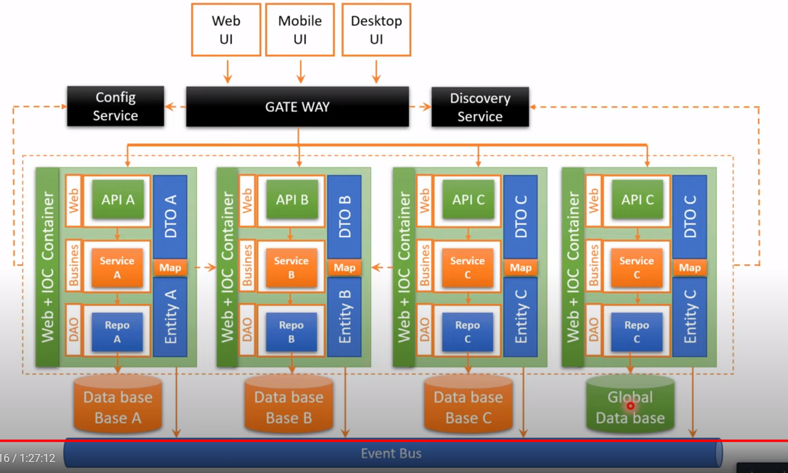
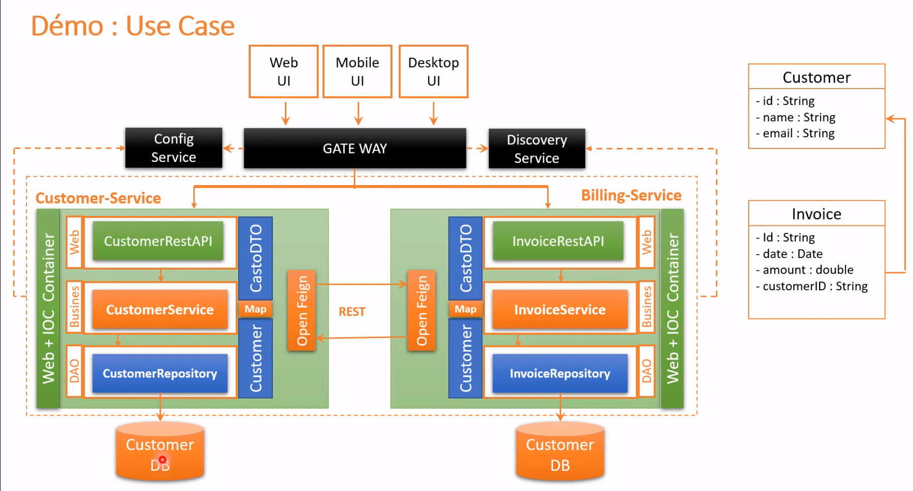
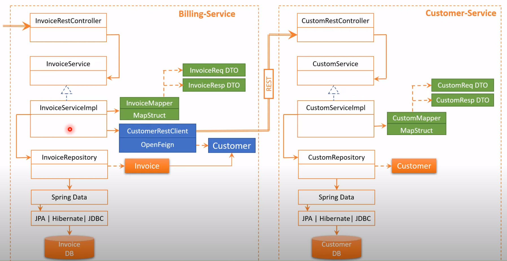

# Les bonnes pratiques et challenges des architectures distribuées basées sur les Micro-services 

**Remember**:

<fieldset>

**“IOC”, “DI” mais c’est quoi au juste?**

L’inversion de contrôle ou IOC pour inversion of control est un principe général de conception dont le but est de diminuer le couplage entre les composants logiciels.

L’injection de dépendances ou DI pour “dependency injection”, est-elle une méthode permettant d’appliquer le principe d’IOC. Le principe est tout simple, il consiste à passer (injecter) un composant logiciel (une classe par exemple) à un autre composant logiciel qui l’utilise, permettant ainsi d’éviter la dépendance d’un composant à un autre et ainsi améliorer la souplesse de l’application.

[<GO TO LINK>](https://www.codeheroes.fr/2017/10/10/node-js-linversion-de-controle-ioc-et-linjection-de-dependances-di/#:~:text=L'inversion%20de%20contr%C3%B4le%20ou,appliquer%20le%20principe%20d'IOC.)

</fieldset>


### Content 
1. [Basics](#architecture-micro-services-et-contraintes)
    1. [Architecture Monolotique et contraintes](#architecture-monolotique-et-contraintes)
    2. [Architecture Micro-services et contraintes](#architecture-micro-services-et-contraintes)
    3. [Gateway](#gateway)
    4. [Modèle de communication entre les microservices](#modèle-de-communication-entre-les-microservices)
    5. [Security challenge ](#security-challenge)
    6. [How to deal with my data ?](#how-to-deal-with-my-data)
    7. [How to deal with my data : CQRS & Event Sourcing](#how-to-deal-with-my-data--cqrs--event-sourcing)
2. [Demo](#demo)
    1. [Use case](#use-case)
    2. [Customer service](#customer-service)
      1. [Dependencies](#customer-service-dependencies)
      2. [Properties file](#customer-service-properties-file)
      3. [JPA Entity](#customer-service-entity)
      4. [JPA Repository](#customer-service-repository)
      5. [Service layer](#customer-service-service-layer)
      6. [DTOs](#customer-service-dtos)
      7. [Mapping](#customer-service-mapping)
      8. [Rest Controller](#customer-service-rest-controller)
    
  


### Architecture Monolotique et contraintes:
- Basé sur plusieurs modèle qui ils sont intégrés dans la même application.
- Une seule base de données.
- Une seule technologie (Côut de formation).
- Processus Unique (Si une fonctionnalité arrête, l'application arrête completement).
- Difficiles à maintenir.
- Difficile à tester.
- Mise en production prend beaucoup de temps.
- Redéploiement à froid (obliger d'acrrêter l'app et la redéploier).
- Performances (Scalabilité).


### Architecture Micro-services et contraintes:
- Un ensembles des modèles séparés avec des bases de données séparées.
- Un ensembles des petites applications.
- Les application front-end ne doivent pas forcement savoir les microservices, ils ont besoin juste de connecter avec la `Gateway`.
- `Gateway` pour chaque requete reçus il va se charger d'acheminer la requete vers le bon Micro-service (Routage).
- Pour svoir dans quelle machine se trouve le Microservice, `Gateway` utilise `Discovery service`, pour un mappage dynamique surtout si on démarre plusieurs instance d'un microservice.
- `Discovery service` se chargé de publier ou d'enregistrer toutes les instance des Micro-services disponibles.
- Chaque microservice qu'il démarre va enregistrer son adresse IP, nom, et port dans le `discovery service`.
- Pour ne pas avoir des conflits de configuration, on utilise le `Config service` qui va se charger de cnetraliser la configuration globale en commun.
- Le microservice reçoit sa configuration à chaud c à d sans avoir besoin l'arrêter.


<fieldset>

`Microservice cherche sa configuration dans Config service` &rarr; `Microservice Démarre` &rarr; `Microservice Démarre` &rarr; `Microservice Démarre` &rarr; 
.... youtba3
<fieldset>


- `Event Bus`: pour une communication asynchronne entre les microservices.

**Avantages**

- **Performance (Scalabilité Horzontale)** : Si on a un problème de monté en charge il suffit démarrer d'autres instances du micro-service affecter, il va s'enregistrer dans le `discovery service` et il va etre disponible, la `Gateway` dans ce cas là va utiliser un système d'équilibrage de charge `load balancer` entre les instances.
- Processus séparés.
- Faciles à développer à tester et à maintenir.
- Mise en production rapide des micro-services.
- Redéploiement à chaud.
- Téchnologies déffirentes.
- Equipes indépendentes.
- Facile à appliquer l'agilité.
- Facile à mettre en oeuvre TDD (Test puis fonctionnalité).

### Gateway

|ZUUL|Spring Cloud Gateway|
|--|--|
|Modèle Multi thread avec des entrés sorties bloquantes|Modèle Single thread avec des entrés sorties non bloquantes|
|Thread pour chaque requête|Un thread pour toutes les requetes (Event loop)|
|Thread peut etre mobiliser pour une longue durée |Asychronisation, buffering pour servir plusieurs reqêtes|
|N'est pas scalable virticalement |Scalable virticalement|
|Limité par le nombre maximal des threads  |limité par les ressources uniquement|

### Modèle de communication entre les microservices

|Modèle synchrone|Modèle asynchrone|
|--|--|
|REST avec `Open Feign`|Par des `Event Bus`/ `Broker` avec `Kafka, RabbitMQ`|
|Utiliser l'API du service pour envoyer des requêtes HTTP |Les service fait un subscribe dans event bus et attends pour les informations arrivées|
| | |


### Security challenge 

|Modèle d'authentification `Statful`|Modèle d'authentification `Statless`|
|--|--|
|Les informations de la session s'enregistrent dans le côté serveur, le client reçoit un Session ID unique à conserver dans les Cookies pour l'envoyer avec les prochaines requêtes|Les données de la session sont enregistrées dans un `jeton`/ `token` d'authentification délivré au client |
|Utilisé dans la majorité des cas dans les applications monolitiques||
|-|Ex. JWT..|
|-|Plus adapté au Micro-services car on a pas de session partagé entre les services|


**Quelques outils à savoir en ralation avec sécurité**:
- Spring Security
- OAuth2
- JWT
- OpenID Connect
- **Keycloak** : [https://www.keycloak.org/] => Outils prêt
- Spring cloud OAuth


### How to deal with my data ?

- Garder l'architecture Microservices mais avec une seule base de données ??
- L'ideal c'est d'utiliser une DB pour chaque Micro-service, pour garder la performance et la scalabilité.
- Plus Ideal : Utiliser les deux au même temps avec un `Event Bus`: c'est d'avoir des microservices avec leurs bases de données + un qui a une bas de données globale, dans laquel il stock tous les données, Ce microservice attend les evenements du Broker (Event Bus) et mis à jour la base globale.



- On peut fair la même chose si par exemple on a besoin à une base de données pour un moteur de recherche (Elasticsearch), il suffit de créer un autre service handler.


#### How to deal with my data : CQRS & Event Sourcing

- **CQRS**: Command Query Responsability Segregation
- A pattern that separates read and update operations for a data store. Implementing CQRS in your application can maximize its performance, scalability, and security.
- Séparer le bus de lecture du bus d'écriture.
- Le bus de `Command` permet de modifier les données
- Le bus de `Query` permet de la lecture des données.
- **Event Sourcing**: An patern qui consist à ne pas enregister le dernier état de l'application dans la base de donnée mais, d'enregister tous les élements (evenements) de l'application, et qui permet de retrouver l'état de notre app (Je veux l'état de ma base de données d'un mois avant...).
- Outils : `Spring cloud`, `AXION Framework`.
- 

----------------------------------

## Demo

### Use case :
- Respecter tous les bonnes pratiques:





<pre>
Travail à faire :
 Suivre les vidéos Bonnes pratiques de Architectures micro-services :
 1. Vidéo 1 : Concepts de bases
 2.  Vidéo 2 à 5 : Mise en oeuvre d'une application distribuée basée sur deux micro-services en utilisant les bonnes pratiques  :
  - Couches DA0, Service, Web, DTO
  - Utilisation de MapStruct pour le mapping entre les objet Entities et DTO
  - Génération des API-DOCS en utilisant SWAGGER3 (Open API)
  - Communication entre micro-services en utilisant OpenFeign
  - Spring Cloud Gateway
  - Eureka Discovery Service
Travail à rendre Dimanche 31 Octobre
  - etc...
</pre>

### Customer Service

<pre>
DTO: Data transfer object => Objects adapted to the UI layer, it is just a fransfer of the data.
</pre>

#### Customer Service Dependencies 

in `build.gradle`  file (or `pom.xml`) if we use maven we add dependencies.

```groovy
dependencies {
	implementation 'org.springframework.boot:spring-boot-starter-data-jpa'
	implementation 'org.springframework.boot:spring-boot-starter-validation'
	implementation 'org.springframework.boot:spring-boot-starter-webflux'
	implementation 'org.springframework.cloud:spring-cloud-starter-gateway'
	implementation 'org.springframework.cloud:spring-cloud-starter-netflix-eureka-client'
	compileOnly 'org.projectlombok:lombok'
	runtimeOnly 'com.h2database:h2'
	annotationProcessor 'org.projectlombok:lombok'
	testImplementation 'org.springframework.boot:spring-boot-starter-test'
	testImplementation 'io.projectreactor:reactor-test'
	implementation 'org.mapstruct:mapstruct:1.5.3.Final'
	annotationProcessor 'org.mapstruct:mapstruct-processor:1.5.3.Final'
	// https://mvnrepository.com/artifact/org.springdoc/springdoc-openapi-ui
	implementation 'org.springdoc:springdoc-openapi-ui:1.6.12'
}

```

#### Customer Service Properties file

#### Customer Service Entity

#### Customer Service Repository


#### Customer Service Service layer

#### Customer Service DTOs

#### Customer Service Mapping

#### Customer Service Rest Controller


--------------------

### Billing Service


#### Billing Service Dependencies 

```xml

```

#### Billing Service Properties file

#### Billing Service Entity

#### Billing Service Repository


#### Billing Service Service layer

#### Billing Service DTOs

#### Billing Service Mapping

#### Billing Service Rest Controller